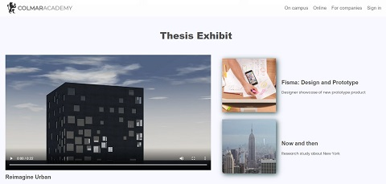

# Colmar Academy

This project was completed as part of Codecademy's Build a Website with HTML, CSS, and Github Pages Path. This was the learn how to build websites capstone project, in which we applied everything we had learned to build a responsive site from scratch. We were required to create a landing page for a new school, Colmar Academy. We were provided with wireframes and video and images resources, and instructed to make all remaining design decisions to complete the site. Responsive design techniques and media queries were utilized to create desktop and mobile versions of the web page.

## Table of Contents

- [Technologies](#technologies)
- [Screenshots](#screenshots)
- [Status](#status)

## Technologies

This project was created with:

- HTML5
- CSS3

## Screenshots

## Status

This project has been completed.